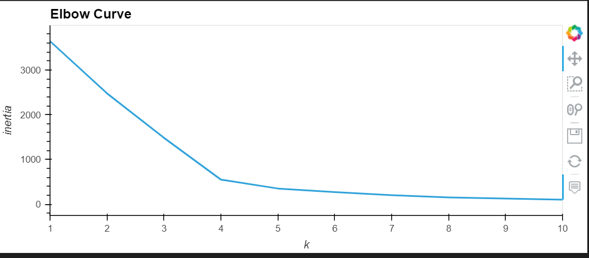
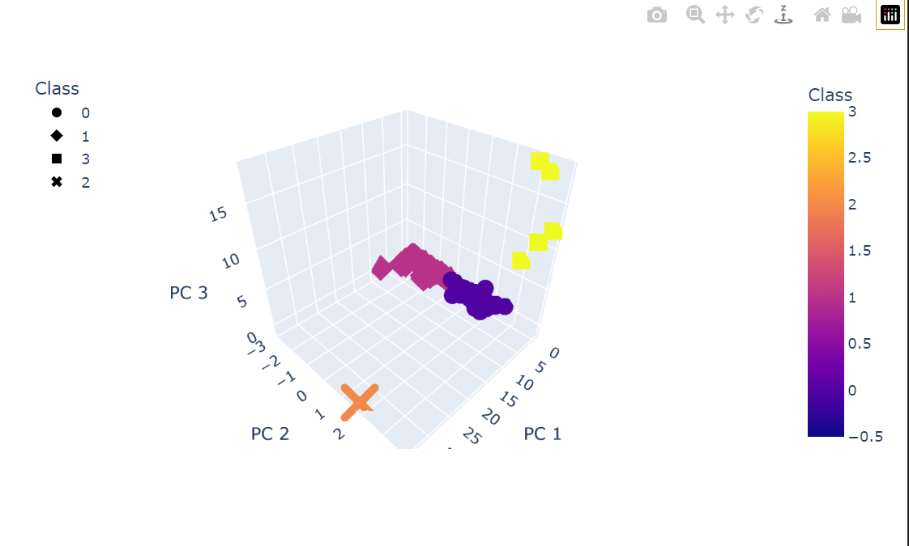
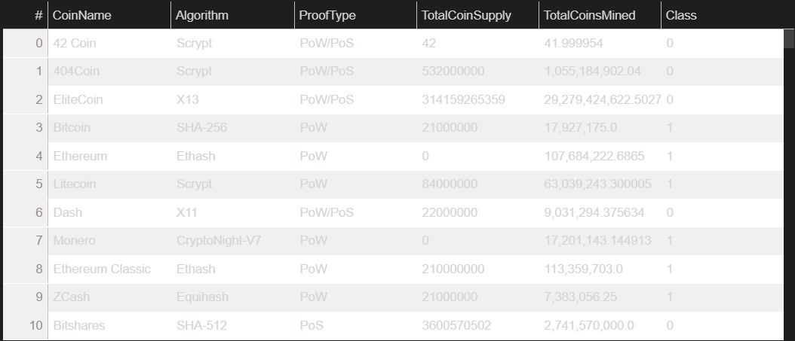
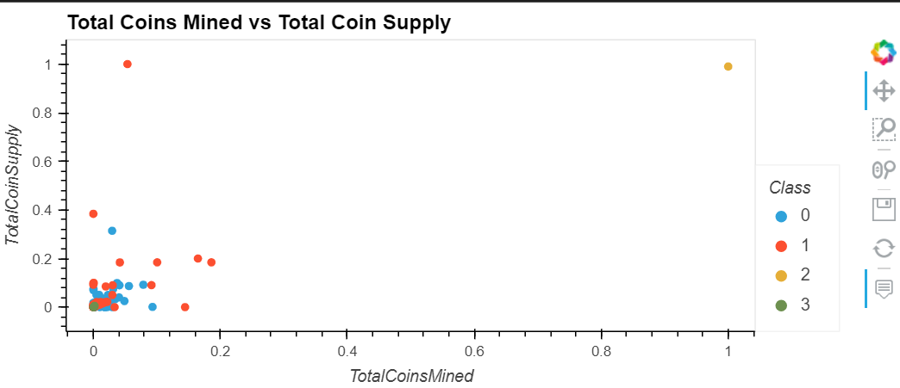

# Cryptocurrencies
Unsupervised Machine Learning, Pandas, hvplot, sklearn, plotly

This project is to create a report that includes what cryptocurrencies are on the trading market and how they could be grouped to create a classification system for this new investment. We will process it to fit the machine learning models. 

